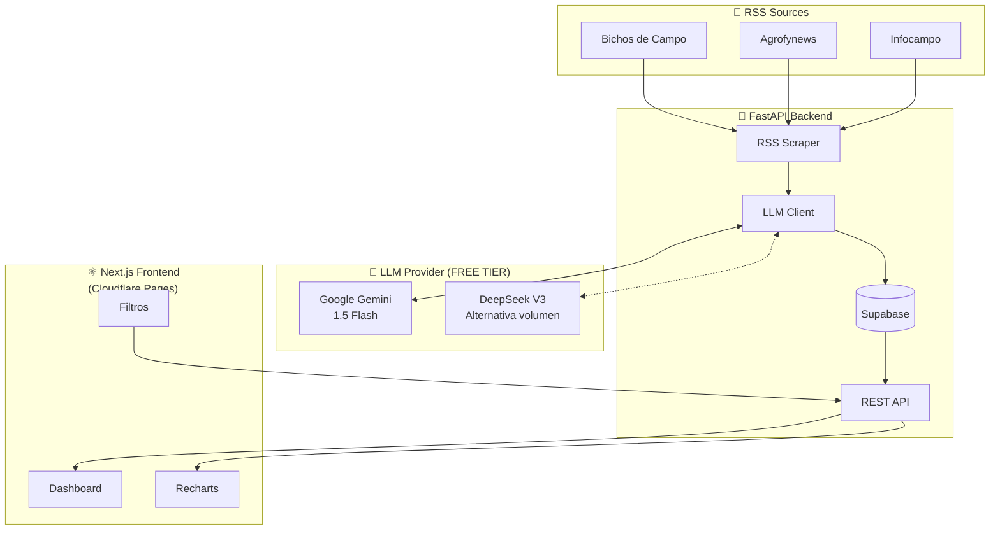
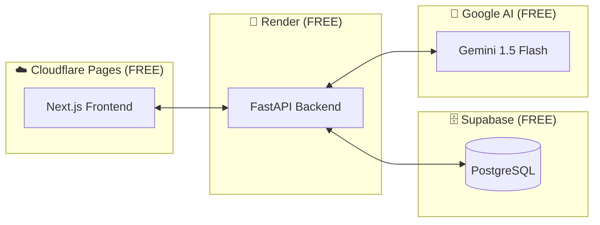

# ROADMAP TÉCNICO - AGROMATE v1.0 (OPTIMIZADO POR COSTOS)

> **Fecha:** 31 de Enero 2026  
> **Estado:** MVP Funcional → Producción  
> **Revisión:** v2 - Stack optimizado para $0 costo operativo inicial

---

## 📋 Resumen Ejecutivo

Este documento define el roadmap técnico optimizado para **minimizar costos operativos**, aprovechando free tiers y alternativas más económicas:

| Componente | Plan Original | Plan Optimizado | Ahorro |
|------------|--------------|-----------------|--------|
| **LLM** | OpenAI gpt-4o-mini | Gemini 1.5 Flash | **$0 (free tier)** |
| **Backend** | Railway ($5/mes) | Render | **$0 (free tier)** |
| **Frontend** | Vercel (riesgo comercial) | Cloudflare Pages | **$0 + comercial OK** |
| **DB** | Supabase | Supabase | $0 (ya configurado) |

**Costo operativo mensual estimado: $0** (dentro de free tiers)

---

## 🏗️ Arquitectura v1.0 (Optimizada)

### Diagrama de Flujo de Datos



---

## 1️⃣ Integración LLM Real (OPTIMIZADO)

### 1.1 Análisis de Modelos - ACTUALIZADO

| Modelo | Proveedor | Costo/1M tokens | Free Tier | Recomendación |
|--------|-----------|----------------|-----------|---------------|
| **Gemini 1.5 Flash** | Google | $0.075 / $0.30 | ✅ **15 RPM gratis** | ✅ **SELECCIONADO** |
| DeepSeek-V3 | DeepSeek | $0.14 / $0.28 | ❌ | Alternativa volumen |
| gpt-4o-mini | OpenAI | $0.15 / $0.60 | ❌ | Descartado (más caro) |

### 1.2 ¿Por qué Gemini 1.5 Flash?

1. **Free Tier Real:** 15 requests por minuto = ~21,600/día gratis
2. **Suficiente para MVP:** Si scrapeamos 50 noticias/día = 1,500/mes (muy dentro del límite)
3. **Si escalamos:** Precio de pago es 50% más barato que OpenAI
4. **JSON Mode:** Soporta `response_mime_type: "application/json"`

### 1.3 Archivos a Modificar/Crear

| Archivo | Acción | Descripción |
|---------|--------|-------------|
| `backend/sentiment/llm_client.py` | MODIFICAR | Agregar `GeminiLLMClient` clase |
| `backend/sentiment/prompts.py` | CREAR | Prompts centralizados |
| `backend/.env` | MODIFICAR | Agregar `GOOGLE_API_KEY` |
| `backend/requirements.txt` | MODIFICAR | Agregar `google-generativeai>=0.3.0` |

### 1.4 Clase GeminiLLMClient (Diseño)

```python
import google.generativeai as genai

class GeminiLLMClient:
    """Real LLM client using Google Gemini API (FREE TIER)."""
    
    def __init__(self, api_key: str):
        genai.configure(api_key=api_key)
        self.model = genai.GenerativeModel(
            model_name="gemini-1.5-flash",
            generation_config={
                "response_mime_type": "application/json",
                "temperature": 0,
                "max_output_tokens": 100
            }
        )
    
    def analyze(self, text: str) -> dict:
        """Analyze sentiment with Gemini."""
        prompt = f"{SYSTEM_PROMPT}\n\nNoticia a analizar:\n{text}"
        response = self.model.generate_content(prompt)
        return json.loads(response.text)
```

### 1.5 Prompt de Sistema Optimizado

```text
Eres un analista experto del mercado agropecuario argentino (Matba Rofex).

Clasificá el sentimiento de esta noticia sobre commodities agrícolas.

REGLAS:
- ALCISTA: Subas de precios, buenas cosechas, exportaciones crecientes, clima favorable.
- BAJISTA: Bajas de precios, sequías, pérdidas, restricciones comerciales.
- NEUTRAL: Info sin impacto claro en precios, datos estadísticos neutros.

COMMODITIES: Soja, Maíz, Trigo, Girasol, Cebada, Sorgo.

Respondé SOLO en JSON:
{"sentiment": "ALCISTA|BAJISTA|NEUTRAL", "confidence": 0.0-1.0, "reasoning": "máx 15 palabras"}
```

### 1.6 Obtener API Key de Google (Gratis)

1. Ir a: https://aistudio.google.com/app/apikey
2. Click en "Create API Key"
3. Copiar la key
4. Agregar a `.env`: `GOOGLE_API_KEY=tu_key_aqui`

---

## 2️⃣ Visualización de Datos (Sin cambios)

### 2.1 Librería: Recharts ✅

Se mantiene la selección de Recharts por ser React-nativo y ligero.

### 2.2 Nuevos Endpoints Backend

| Endpoint | Método | Descripción |
|----------|--------|-------------|
| `/api/trends/daily` | GET | Tendencia últimos 7 días |
| `/api/trends/by-source` | GET | Distribución por fuente |
| `/api/trends/timeline` | GET | Timeline de sentimiento |

### 2.3 Componentes Frontend

| Componente | Tipo | Descripción |
|------------|------|-------------|
| `TrendChart.tsx` | AreaChart | Tendencia diaria |
| `SourcePieChart.tsx` | PieChart | % por fuente |
| `SentimentLine.tsx` | LineChart | Score temporal |

---

## 3️⃣ Filtrado Avanzado (Sin cambios)

### 3.1 Parámetros

```
GET /api/news?source=Bichos+de+Campo&sentiment=ALCISTA&date_from=2026-01-01&limit=50
```

### 3.2 Componente FilterPanel

```tsx
interface FilterState {
  source: string | null;
  sentiment: 'ALCISTA' | 'BAJISTA' | 'NEUTRAL' | null;
  dateFrom: Date | null;
  dateTo: Date | null;
}
```

---

## 4️⃣ Estrategia de Deploy (OPTIMIZADO)

### 4.1 Arquitectura de Producción ($0/mes)



### 4.2 Backend: Render (FREE TIER)

**¿Por qué Render en vez de Railway?**
- Railway eliminó free tier permanente ($5/mes mínimo)
- Render tiene free tier genuino

**Limitaciones del Free Tier:**
- ⚠️ Cold start: ~30-50 segundos si nadie usa la app por 15 min
- Solución: Usar un health check cada 14 min (gratis con UptimeRobot)

**Checklist Render:**
- [ ] Crear cuenta en render.com
- [ ] Conectar repo GitHub
- [ ] Configurar como "Web Service"
- [ ] Build Command: `pip install -r requirements.txt`
- [ ] Start Command: `uvicorn main:app --host 0.0.0.0 --port $PORT`
- [ ] Configurar Environment Variables:
  - `SUPABASE_URL`
  - `SUPABASE_ANON_KEY`
  - `GOOGLE_API_KEY`
- [ ] Configurar UptimeRobot para ping cada 14 min

### 4.3 Frontend: Cloudflare Pages (FREE)

**¿Por qué Cloudflare Pages en vez de Vercel?**
- Vercel Hobby prohíbe uso comercial
- Cloudflare Pages permite comercial en free tier
- Extremadamente rápido (edge network global)
- Build automático desde GitHub

**Checklist Cloudflare Pages:**
- [ ] Crear cuenta en cloudflare.com
- [ ] Ir a Workers & Pages → Create application → Pages
- [ ] Conectar repo GitHub
- [ ] Framework preset: Next.js (Static HTML Export)
- [ ] Build command: `npm run build`
- [ ] Build output: `out` (o `.next` si SSR)
- [ ] Environment variable: `NEXT_PUBLIC_API_URL=https://agromate-api.onrender.com`

### 4.4 Configuración Next.js para Static Export

```javascript
// next.config.mjs
const nextConfig = {
  output: 'export',  // Static HTML export
  images: {
    unoptimized: true  // Required for static export
  }
};

export default nextConfig;
```

### 4.5 Variables de Entorno Finales

| Variable | Render | Cloudflare | Valor |
|----------|--------|------------|-------|
| `SUPABASE_URL` | ✅ | ❌ | URL de Supabase |
| `SUPABASE_ANON_KEY` | ✅ | ❌ | API key Supabase |
| `GOOGLE_API_KEY` | ✅ | ❌ | API key Gemini |
| `NEXT_PUBLIC_API_URL` | ❌ | ✅ | URL del backend Render |

### 4.6 CORS para Producción

```python
# backend/main.py
import os

ALLOWED_ORIGINS = [
    "https://agromate.pages.dev",  # Cloudflare
    "https://agromate.com",        # Custom domain
    "http://localhost:3000"        # Dev
]

app.add_middleware(
    CORSMiddleware,
    allow_origins=ALLOWED_ORIGINS,
    allow_credentials=True,
    allow_methods=["GET", "POST"],
    allow_headers=["*"],
)
```

---

## 💰 Comparación de Costos

### Plan Original vs Optimizado

| Componente | Original | Optimizado | Ahorro/mes |
|------------|----------|------------|------------|
| LLM | $5-15 (OpenAI) | $0 (Gemini free) | **$5-15** |
| Backend | $5 (Railway) | $0 (Render free) | **$5** |
| Frontend | $0-20 (Vercel) | $0 (Cloudflare) | **$0-20** |
| Database | $0 (Supabase) | $0 (Supabase) | $0 |
| **TOTAL** | **$10-40/mes** | **$0/mes** | **$10-40** |

### Cuándo escalar (y pagar)

| Métrica | Free Tier Limit | Trigger para pagar |
|---------|-----------------|-------------------|
| Gemini API | 15 RPM | >1,000 análisis/hora |
| Render | Cold starts | Si molestan los 30s de espera |
| Cloudflare | 500 builds/mes | >16 deploys/día |
| Supabase | 500MB DB | >500MB de noticias |

---

## 📅 Timeline de Implementación (Revisado)

| Fase | Duración | Entregables |
|------|----------|-------------|
| **Fase A: Gemini LLM** | 1-2 días | GeminiLLMClient, prompts, tests |
| **Fase B: Visualizaciones** | 2-3 días | Endpoints trends, Recharts |
| **Fase C: Filtros** | 1-2 días | FilterPanel, query params |
| **Fase D: Deploy** | 1 día | Render + Cloudflare configurados |
| **Fase E: QA** | 1 día | Testing E2E, UptimeRobot |

**Total estimado: 6-9 días**

---

## ✅ Criterios de Aceptación v1.0

- [ ] Gemini clasificando con >85% accuracy
- [ ] Dashboard con 2+ gráficos funcionales
- [ ] Filtros funcionando (fuente, sentimiento, fecha)
- [ ] Deploy en Render + Cloudflare ($0/mes)
- [ ] Cold start <60 segundos
- [ ] UptimeRobot configurado (evitar cold starts)

---

## 🎯 Próximos Pasos

1. **✅ Aprobar roadmap optimizado**
2. Obtener Google API Key (gratis)
3. Implementar GeminiLLMClient
4. Crear endpoints de tendencias
5. Agregar Recharts
6. Deploy a Render + Cloudflare
7. Configurar UptimeRobot

---

## 🔄 Plan B: DeepSeek para Volumen Alto

Si eventualmente necesitás analizar >1,000 noticias/hora:

```python
class DeepSeekLLMClient:
    """Alternative for high volume - very cheap with context caching."""
    
    def __init__(self, api_key: str):
        self.client = OpenAI(
            api_key=api_key,
            base_url="https://api.deepseek.com"
        )
        self.model = "deepseek-chat"
```

Costo con cache: **$0.014/1M tokens** (10x más barato que OpenAI)

---

> **¿Aprobás este plan optimizado para $0 costo operativo?**

